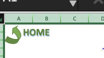
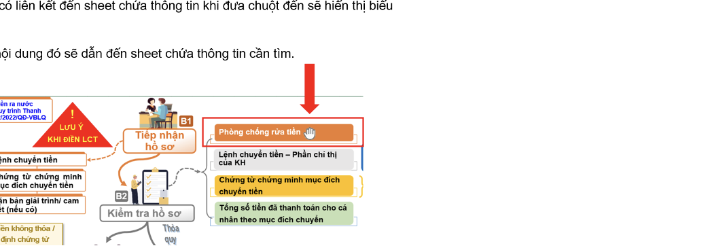
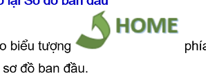
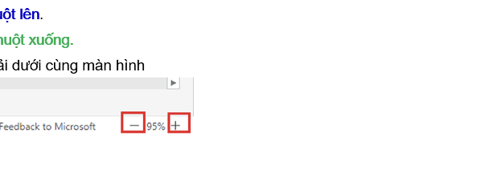
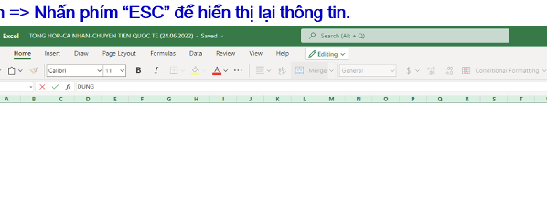

# OCR Analysis with Sub-Images

**Source Image:** `sheet2.png`  
**Processed:** 2025-10-21 17:34:36  
**Model:** Claude Sonnet 4.5 (Bedrock)  
**Sub-images extracted:** 5  
**Sub-images directory:** `sheet2_subimages/`

---

# Hướng dẫn sử dụng:

*HOME icon with house symbol*

## 1. Đã điền sheet có thông tin liên kết.

✓ Những nơi dùng có liên kết đến sheet chưa thông tin khi chưa của chuyển sẽ hiện thị biểu tượng: 👆

✓ Click chuột vào nó dùng đó sẽ dẫn đến sheet chưa thông tin cần tìm.

*Workflow diagram showing process steps with boxes and arrows, including sections for "Thủ tục LCT", "Tiếp nhận Hồ sơ", "Kiểm tra hồ sơ", and various decision points and actions*

## 2. Quay trở lại Sơ đồ ban đầu

*HOME icon with house symbol repeated*

✓ Click vào biểu tượng 👆 phía trên cùng góc trái các sheet chưa thông tin để quay về sơ đồ ban đầu.

## 3. Zoom in / Zoom out

Người dùng có thể zoom in (phóng to) / zoom out (thu nhỏ) màn hình để trụân tiện xem các thông tin trong sheet bằng cách:

**Cách 1:** Dễ chuột ở vị trí cần zoom trên màn hình:

- **Zoom in:** Giữ phím **Ctrl + Lăn chuột lên**.
- **Zoom out:** Giữ phím **Ctrl + Lăn chuột xuống**.

**Cách 2:** Sử dụng chức năng zoom ở góc phải dưới cùng màn hình

*Zoom control interface showing feedback option and zoom slider with + and - buttons*

- Zoom in: Click dấu "**+**"
- Zoom out: Click dấu "**-**"

## 4. Trường hợp click chuột vào màn hình nhiều lần làm toàn màn hình tráng, không hiện thị thông tin ⇒ Nhấn phím "ESC" để hiện thị lại thông tin.

*Screenshot of Excel spreadsheet interface showing empty cells and row/column headers*

---

## Extracted Sub-Images

| # | Description | Position | File |
|---|-------------|----------|------|
| 1 | HOME icon with house symbol | top-left | `subimg_01_top_left.png` |
| 2 | Workflow diagram showing process steps with boxes and arrows, including sections for "Thủ tục LCT", "Tiếp nhận Hồ sơ", "Kiểm tra hồ sơ", and various decision points and actions | center | `subimg_02_center.png` |
| 3 | HOME icon with house symbol repeated | middle-left | `subimg_03_middle_left.png` |
| 4 | Zoom control interface showing feedback option and zoom slider with + and - buttons | center | `subimg_04_center.png` |
| 5 | Screenshot of Excel spreadsheet interface showing empty cells and row/column headers | bottom-left | `subimg_05_bottom_left.png` |

*Generated by AWS Bedrock OCR with Sub-Image Extraction*
